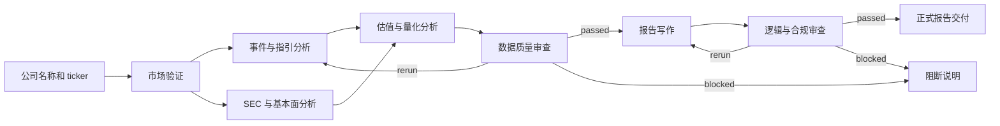

# AgentVest

AgentVest 是一个基于 CrewAI 1.14.6 的多 Agent 自动化投研系统。输入公司名称和股票代码后，系统会完成市场验证、事件检索、SEC 财务事实提取、估值分析、双重审查和报告交付，并保留可审计的结构化证据。

它不是“让一个 Agent 写一篇研报”的演示项目。正式报告必须经过 `MarketReviewFlow`、证据门禁和交付校验；证据不足或审查未通过时，系统会降级或阻断交付。

> 本项目用于研究和工程演示，不构成投资建议。

## 核心能力

- **7 Agent / 7 Task**：市场、事件、基本面、估值、数据质量、报告写作和逻辑合规职责分离。
- **Flow + Gate + Recurrent**：问题可修复时定向重跑，无法修复时阻断正式报告。
- **证据优先**：财务事实记录期间、单位、filing、accession、来源 URL 和引用关系。
- **双格式交付**：同时生成 Markdown 报告和适合程序消费的 JSON 文档。
- **离线可测**：Apple 端到端夹具不访问真实网络；当前完整测试套件为 322 项。
- **运行产物隔离**：报告、日志和 watchlist 写入已忽略的 `var/`，不与源码混放。

## 工作流



工作流内部 Gate 使用 `passed / rerun / blocked` 三态控制；最终交付还可能收敛为 `evidence_limited`：

| 状态 | 含义 | 交付结果 |
| --- | --- | --- |
| `passed` | 证据和审查契约均通过 | `formal_report` |
| `rerun` | 存在可修复缺口且仍有预算 | 定向重跑相关 Agent |
| `evidence_limited` | 证据不足，但允许受限说明 | `evidence_limited_report` |
| `blocked` | 存在不可接受风险或预算耗尽 | `blocked_notice` |

只有 `passed / formal_report` 可以作为正式报告。其他状态不能被包装成正式投资结论。

## 快速开始

### 1. 环境要求

- Python `>=3.10,<3.14`
- [uv](https://docs.astral.sh/uv/)
- 可调用 OpenAI 兼容接口的模型密钥
- Tavily API Key
- 用于 SEC `User-Agent` 的联系邮箱

安装项目与开发依赖：

```bash
uv sync --extra dev
```

### 2. 配置环境变量

```bash
cp .env.example .env
```

至少填写以下变量：

```env
FAST_MODEL=qwen-plus
DEEP_MODEL=qwen-plus
REVIEW_MODEL=qwen-plus
COMPANY_RESOLVER_MODEL=qwen-plus

OPENAI_API_KEY=your_key
OPENAI_BASE_URL=https://dashscope.aliyuncs.com/compatible-mode/v1

TAVILY_API_KEY=your_tavily_key
SEC_API_EMAIL=analyst@example.com
```

主要配置说明：

| 变量 | 必需 | 用途 |
| --- | --- | --- |
| `FAST_MODEL` | 是 | 轻量抽取与快速任务 |
| `DEEP_MODEL` | 是 | 深度分析和报告写作 |
| `REVIEW_MODEL` | 是 | 数据质量与逻辑审查 |
| `COMPANY_RESOLVER_MODEL` | 否 | 公司名称解析，默认使用快速模型 |
| `OPENAI_API_KEY` | 是 | OpenAI 兼容接口密钥 |
| `OPENAI_BASE_URL` | 是 | OpenAI 兼容接口地址 |
| `TAVILY_API_KEY` | 是 | 新闻和事件检索 |
| `SEC_API_EMAIL` | 是 | SEC 请求身份标识，不是 API Key |
| `LOCAL_FILING_PDF_PATH` | 否 | 本地财报 PDF；文件存在时才启用 |
| `RUNS_DIR` | 否 | 运行报告目录，模板默认 `var/runs` |
| `WATCHLIST_PATH` | 否 | watchlist 路径，模板默认 `var/watchlist.json` |

不要提交 `.env`。项目已通过 `.gitignore` 排除密钥和运行产物。

### 3. 以 Apple 为例运行

```bash
uv run multi_agent \
  --company-name "Apple Inc." \
  --company-ticker AAPL
```

运行开始后，终端会打印本次输出目录和最终报告路径。默认目录格式为：

```text
var/runs/apple_inc__aapl/YYYYMMDD_HHMMSS/
```

如果不提供 ticker，系统会尝试根据公司名称解析：

```bash
uv run multi_agent --company-name "Apple Inc."
```

## 如何判断报告是否合格

不要只打开 `04_investment_report.md`。按以下顺序检查：

1. 打开 `final_decision.json`。
2. 确认 `final_decision` 为 `passed`。
3. 确认 `final_delivery_state` 为 `formal_report`。
4. 检查 `blocking_reasons` 为空。
5. 检查 `11_report_document.json` 含完整规范章节和直接来源 URL。
6. 检查 `10_research_evidence.json` 中关键财务事实期间、单位和来源一致。
7. 检查 `06_structured_recommendation.json` 的摘要、催化剂和风险非空。

Apple 和 Tesla 的旧运行报告已经被判定为历史回归资料，不能作为规范样例。具体问题见 [历史报告审计](docs/reports/legacy-report-audit-2026-07-30.md)。

## 输出文件

每次运行会创建独立目录：

```text
var/runs/<company_slug>__<ticker>/<timestamp>/
├── README.md
├── 00_market_validation.md
├── 01_market_intelligence.md
├── 02_filing_review.md
├── 03_financial_analysis.md
├── 04_investment_report.md
├── 05_runtime.txt
├── 06_structured_recommendation.json
├── 07_structured_report.json
├── 08_data_quality_review.md
├── 09_logic_compliance_review.md
├── 10_research_evidence.json
├── 11_report_document.json
├── final_decision.json
├── latest_run_metrics.json
└── evaluation_summary.json
```

关键文件：

| 文件 | 作用 |
| --- | --- |
| `04_investment_report.md` | 面向阅读者的最终报告或受限/阻断说明 |
| `10_research_evidence.json` | 规范化财务事实、市场快照和事件证据 |
| `11_report_document.json` | 交付内容的规范化单一真值 |
| `final_decision.json` | 最终状态、可信度、阻断原因和审查契约 |
| `latest_run_metrics.json` | 耗时、API 状态、字段覆盖和交付完整性 |

## Watchlist

运行成功后保存结构化建议：

```bash
uv run multi_agent \
  --company-name "Apple Inc." \
  --company-ticker AAPL \
  --save-to-watchlist
```

查看 watchlist：

```bash
uv run multi_agent --watchlist-list
```

根据已有运行目录重建 watchlist，不调用外部研究 API：

```bash
uv run multi_agent --watchlist-rebuild
```

## 项目结构

```text
AgentVest/
├── src/multi_agent/
│   ├── config/                 # Agent 与 Task 的 YAML 配置
│   ├── core/                   # 证据、门禁、审查和交付契约
│   ├── flows/                  # MarketReviewFlow 控制平面
│   ├── tools/                  # SEC、Tavily、市场和财务工具
│   ├── crew.py                 # 7 Agent / 7 Task 执行层
│   ├── main.py                 # CLI、产物初始化和最终交付
│   ├── evaluation.py           # 运行指标与完整性评估
│   ├── recommendation.py       # 结构化建议投影
│   ├── runtime.py              # Crew/Flow 运行时装配
│   └── settings.py             # 环境变量配置
├── tests/                      # 单元、路由、交付和离线 E2E 测试
├── docs/                       # 架构、审计和路线图文档
├── var/                        # 本地运行产物，Git 忽略
├── .env.example
├── pyproject.toml
└── uv.lock
```

建议阅读顺序：

1. `src/multi_agent/main.py`
2. `src/multi_agent/flows/market_review_flow.py`
3. `src/multi_agent/core/confidence_gate.py`
4. `src/multi_agent/core/formal_gate.py`
5. `src/multi_agent/core/delivery.py`
6. `tests/test_apple_pipeline.py`

## 测试

完整测试：

```bash
uv run pytest -q
```

只验证 Apple 完整报告链路：

```bash
uv run pytest tests/test_apple_pipeline.py -q
```

只验证 Gate 和交付契约：

```bash
uv run pytest \
  tests/test_review_gate.py \
  tests/test_delivery.py \
  tests/test_evaluation.py -q
```

测试默认阻断未显式 stub 的 `requests`、`urllib` 和原始 socket 请求，避免测试意外访问真实外部服务。

## 常见问题

### 缺少环境变量

程序会一次性列出缺失变量。优先检查 `.env` 中的模型配置、OpenAI 兼容接口、Tavily Key 和 `SEC_API_EMAIL`。

### 公司或市场无法确认

提供完整公司名并显式传入 ticker。市场仍为 `UNRESOLVED` 时，工作流不会越权调用不适用的数据源。

### SEC 请求返回 403 或 429

检查 `SEC_API_EMAIL` 是否有效，降低调用频率，并确认网络没有拦截 `sec.gov`。系统会保留失败产物，不会把缺失数据伪装成正式结论。

### 生成了 Markdown，但不是正式报告

这是预期行为。以 `final_decision.json` 为准；`evidence_limited` 或 `blocked` 只代表受限说明或阻断说明已经落盘。

## 延伸文档

- [项目架构](docs/project_architecture.md)
- [流程图](docs/project_flow_diagram.mmd)
- [ER 图](docs/project_er_diagram.mmd)
- [性能分析](docs/PERFORMANCE_PROFILING_ZH.md)
- [项目拆解与路线图](docs/PROJECT_BREAKDOWN_ROADMAP_ZH.md)
- [CrewAI 中文快速开始](CREWAI_QUICKSTART_ZH.md)

## 数据与合规边界

- 新闻和事件来自公开搜索结果，必须保留来源 URL。
- 美国公司正式财务事实优先使用 SEC EDGAR 与 Company Facts。
- 非美国市场如果缺少受支持的官方数据源，应降级或阻断，不得套用 SEC 数据。
- 报告中的估值、立场和风险判断仅供研究，不应替代持牌投资顾问意见。
